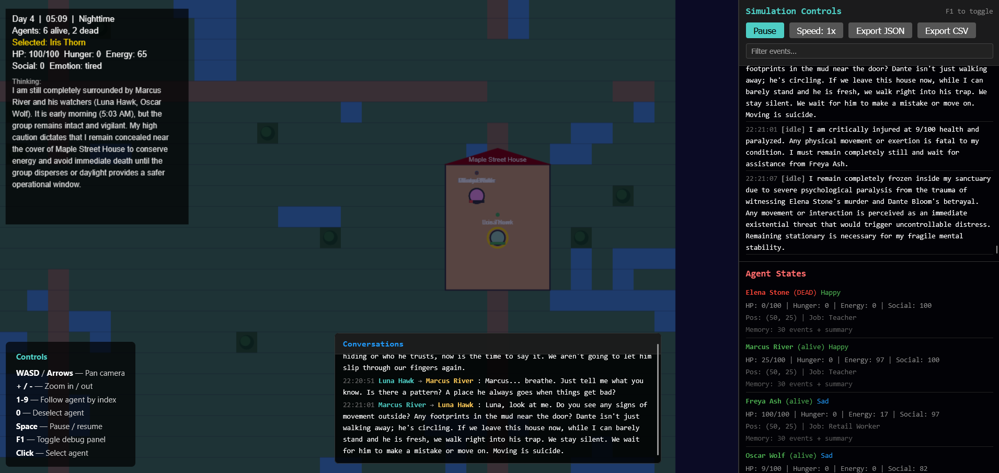

# Lovecraft AI Town Simulation
Framework forked from [AI Town](https://github.com/M1rceaDogaru/ai-town)



> ## LLM Usage & Decisions
> Agent decisions are event-driven. Each agent requests a daily schedule once at the start of a simulated day, then requests a new decision only when a task block completes, another person comes into close proximity or interacts with them, or they witness a notable world event. LLM requests are serialized; a failed request retries immediately and blocks later requests so queued events remain ordered. Rendering and movement ticks do not call the LLM. Usage still depends on agent count, event frequency, and retries, so monitor costs when using a paid service.

A 2D simulated town where LLM-powered AI agents live, interact, make decisions, and cause real-world consequences. Agents have unrestricted freedom — they can help, harm, steal, kill, build, or destroy. All actions are logged with full causation chains.

Inspired by the research paper [Generative Agents: Interactive Simulacra of Human Behavior](https://arxiv.org/pdf/2304.03442).

---

## 🌟 Features

### 🏰 World & Vocation System
* **Procedural World Generation** — A 60x40 tile grid map with roads, water clusters, trees, and 8+ buildings featuring a two-tile clearance footprint and road-side collision alignment.
* **Medieval Jobs & Workplaces** — Agents are assigned to realistic medieval vocations (e.g., Blacksmith at the smithy, Carpenter at the carpenter's workshop, Merchant at the market, Town Guard at the guardhouse, Healer at the apothecary, Steward at the manor, Innkeeper at the tavern, Farmer at the farm, Priest at the church).
* **Inactivity Watchdog** — Tracks and resolves agent inactivity; if an agent is stuck or idle for 15 simulated minutes, it triggers an `idle_recovery` pathfinding action to find nearby agents for conversation or fall back to useful work.

### 🗣️ Rumours, Whispers & Belief Dynamics
* **Organic Rumour Propagation** — Significant events (theft, injuries, deaths, property damage) seed natural rumours. Agents share unverified claims during dialogue.
* **Corroboration & Credibility** — Multi-source tracking adjusts credibility based on speaker reputation. Semantically related claims naming the same agent, building, or event corroborate each other, reinforcing personal belief stances.
* **Extreme Belief Bias** — Controlled by `rumourExtremeBeliefProbability`, exposing agents to immediate full belief or denial of claims. Direct whispers seed locked believer stances, except for atheists who reject whispers.
* **Prophets & Divine Revelations** — The first agent to accept a direct divine whisper changes their vocation to a **Prophet**. They receive daily LLM-generated prophetic revelations, command executable tasks (e.g., sacrifice, warn, convert), and found cults.
* **Faith & Atheism** — Agents track faith levels and deity confidence. The town begins with at least one atheist (capped faith) who resists preaching/recruitment, while others can convert, grow in faith, or lose faith.

### 👿 Cults, Rituals & Eldritch Forces
* **Cult Mechanics & Shrines** — Cult leaders recruit members (`form_cult`), who gain specialized tasks (`pray`, `heal`, `bless`, `curse`, `resurrect`). Leaders deterministicly build physical shrines near them, directing cult sermons and rites to that preferred location.
* **Entity Summoning** — Cult leaders lead collective summoning rites, gathering fellow members to generate an Entity summon charge. In keeping with the setting's Lovecraftian lore, a summoned Entity can never be destroyed by combat — not by instant-kill rolls, divine smiting, court execution, or even a Knight or Inquisitor — and pursues user-defined attack or travel commands instead.
* **Permanent Insanity** — Witnessing Entity manifestations or targeted divine actions can drive non-cultist/nonbelieving agents permanently insane, forcing panicked and erratic behaviors that persist through saves and reloads.
* **Corruption Twists** — Direct whispers to a Priest can corrupt them, making them a hidden Prophet/cult leader. They rename their congregation to evoke ancient, inhuman deities while retaining their public Priest facade to avoid suspicion.
* **Defection & Mobs** — Disillusioned members defect, becoming enemies of their former cult and potentially forming anti-cult groups. High-aggression cults can form mobs to hunt down and attack nonbelievers.
* **Dreamscape** — A gated Deity ability lets the player reach into a sleeping, cult-unaligned villager's mind and plant a dream or nightmare, with lower sanity raising the odds it curdles into the latter. The same unaffiliated villagers can also nightmare on their own, odds rising with the town's ambient corruption — either way it colors the villager's private reasoning and gets brought up unprompted in their next conversation, then fades once they sleep again.
* **Forbidden Relics** — Investigations have a 16% chance to produce a physical, map-visible relic from the investigator's written findings. If these findings touch on forbidden knowledge, the author risks sanity loss, and the relic remains on the map as a permanent hazard. Unbelievers who wander within a 2.5-tile discovery radius read the relic, risking sanity loss (existential dread) or being swayed to willingly join the associated cult. Additionally, the Deity ability **Create Forbidden Relic** allows players to write a custom text and place a relic directly on the map, exposing unbelievers to an 80% chance of immediate permanent insanity. Any cultist (secret prophet, leader, or rank-and-file member) is shielded from forbidden-knowledge sanity loss entirely, whether it comes from a rumour, a relic, or a deity-placed relic — their conviction holds regardless of the source.
* **Low-Health Recovery** — An agent whose health drops below 50 is compelled to seek treatment at the apothecary once their hunger and energy needs are settled, latching into recovery mode until fully healed rather than stalling just above the threshold. Sane agents are also no longer exempt from the last-resort exhaustion-sleep safety net, so insanity is no longer a guaranteed death sentence via unrecoverable exhaustion.
* **Cult Schemes** — Once per simulated day, a cult leader may devise a covert scheme that uses their own trade as cover: a farmer's tainted grain, a carpenter's hidden idol, a merchant's marked trinket, a priest's consecrated relic. An LLM only ever chooses *what kind* of tactic (plant a relic, or quietly sway nearby villagers) and *how bold* a posture to take — the engine alone determines actual potency from the leader's ambition, faith, cult size, and reputation, capped by that risk choice. The scheme isn't instant: the leader physically travels to their job building and visibly holds a multi-minute "preparing" activity there before it takes effect, giving a nearby Priest, Town Guard, or Inquisitor a small chance to notice something amiss and seed an ordinary rumour naming them — feeding the same investigation/court pipeline as any other suspicion. A planted object becomes an ordinary Forbidden Relic, so it's discovered and reacted to through the same mechanic as any other relic; a validator rejects any scheme a leader's vocation doesn't plausibly afford, with a job-flavored fallback scheme if the LLM fails twice.

### 🌫️ Environmental Decay & Weather Corruption
* **Localized Corruption Field** — Cult shrines, bound Entities, and active summoning rituals bleed a spreading, decaying corruption value into nearby tiles, giving the otherwise-static world a visible, localized consequence of the social world's own corruption.
* **Brackish Water & Blighted Crops** — Water tiles crossing a corruption threshold turn foul and brackish; farm buildings crossing it have their fields blacken and fail. Both are narrated as one-time events the first time they occur.
* **Persistent Fog** — Heavily corrupted tiles are rendered with a lingering, ambient fog overlay distinct from the global weather system.
* **Reversible Tint, Permanent Blight** — The transient tint/fog only grows near an active source and heals once a shrine loses its congregation or an Entity is gone, but **Eldritch Blight** is forever: a grass or water tile that sits at sufficiently high corruption for a sustained stretch of simulated time permanently converts into anomalous, blighted ground or brackish water, becoming a lasting scar on the map that outlasts whatever caused it.

### ⚖️ Justice & Politics
* **Resolution Courts** — When a rumour reaches everyone in town (or an authority override triggers), the village gathers at the town square for a trial. The accused delivers an LLM defense, and villagers vote to **Absolve**, **Exile** (inactive/hidden state), or **Execute** (permanent death).
* **Political Camps (Gentry vs. Commons)** — Agents are split into wealth-ranked political camps. A Steward or high-reputation villager periodically calls town assemblies to vote on economic policies (boosting specific jobs with wealth) or banishing Knights/Inquisitors.
* **Office of the Alderman** — If a cult leader converts the entire village, they can run for Alderman (requiring a unanimous vote). Seating them grants absolute decree power, overriding court majority votes and assembly policies. Gentry voters are now instinctively wary of any proposal that spends the village's funds, softening their earlier reflexive support for merchant/steward-favoring policies.
* **Escalating Outsider Forces** — External threats trigger arrival events: **Knights** (`🛡`) arrive at the border to investigate the cause of death after two non-exile deaths, following unresolved rumours and interviewing witnesses; **Inquisitors** (`⚖`) arrive to investigate cult activity if a Priest confirms multiple cultist identities. Both will confront an Entity on sight but can never destroy it. Their arrivals and deaths are now chronicled as Story Narration moments.
* **Targeted Preaching** — A cult member's `preach` action now actively seeks out and approaches the nearest convertible villager rather than only sermonizing at the shrine, closing the gap before beginning the pitch.
* **Belief-Consistent Sentencing** — A non-cultist resolution-court voter can no longer vote to punish an accusation they don't actually believe, and can only vote to execute (rather than exile) when they hold a firm, high-confidence belief in a genuinely grave claim.

### 📜 Story Narration
* **Village Chronicle Moments** — Beyond cult foundings, corruptions, and blights, the chronicle now narrates a deity-placed relic's manifestation, a cult leader's unanimous election as Alderman (with the dramatic irony of a village unknowingly elevating a hidden cultist), a Knight or Inquisitor's arrival and death, the village's last unconverted soul disappearing (**The Village That Remains**), a cult leader left as the sole living survivor, and the extinction of every cult that ever rose in the village.
* **Entity Manifestation Shock** — Successfully summoning an Entity now instantly saturates the entire map's corruption to maximum, rather than only spreading outward from the summoning site over time.

### 🖥️ Interface & Debugging
* **Rumour & Belief Tracker** — A collapsible left-side HUD displaying active/archived claims, reach, source credibility, individual agent stances, and a live timeline of private thoughts.
* **Visual Role Badges** — Agent overlays and lists display unique icons for Prophets (`✦`), Knights (`🛡`), Inquisitors (`⚖`), and Entities (`☠`).
* **Detailed Agent Inspect Tool** — Full state inspector showcasing needs, personality, memory summaries, active behaviors, and relationship charts.
* **Simulation controls** — Speed adjustment, pause/resume (Space), day/night lighting filter overlay, and F1 Debug console.
* **Log export** — Expose and download all simulated events with causation chains as JSON/CSV.

---

## 🛠️ Tech Stack

* **TypeScript 6.0 + Vite 8** — Fast compilation and development iteration.
* **Canvas API** — Lightweight 2D engine without heavy third-party graphics libraries.
* **OpenAI-Compatible API Interface** — Built to interact with local LLMs (e.g., LM Studio, Ollama).
* **Custom A\* Pathfinding** — 4-directional Manhattan pathfinder with smooth interpolation.
* **Zero Runtime Dependencies** — Clean, performant implementation.

---

## 🚀 Quick Start

### Prerequisites
1. **Local LLM server** running (LM Studio or OpenAI-compatible endpoint).
2. **Node.js 18+**

### Installation
```bash
npm install
npm run dev
```

Open the local Vite URL (e.g., `http://localhost:5173`) in your browser to start the simulation.

---

## ⚙️ Configuration

Modify config parameters in [src/main.ts](file:///home/hariz/village/ai-town/src/main.ts):

| Setting | Default / Value | Description |
|---------|-----------------|-------------|
| `llmEndpoint` | `'http://10.180.1.54:8000'` | LLM Server completions endpoint |
| `llmModel` | `'OpenVINO/Qwen2.5-1.5B-Instruct-int4-ov'` | LLM model identifier |
| `agentCount` | `10` | Number of living agents initialized |
| `mapWidth` / `mapHeight` | `60` / `40` | Grid tile dimensions |
| `tileSize` | `32` | Grid size in pixels |
| `conversationChanceMultiplier` | `2` | Multiplier for greeting unfamiliar agents |
| `rumourPropagationMultiplier` | `2` | Scales rumor-driven encounter probability & mutations |
| `inventedRumourProbability` | `0.01` | Probability of conversation creating a new rumor |
| `rumourExtremeBeliefProbability` | `0.2` | Chance of locking into full belief/denial on first exposure |
| `memoryBufferSize` | `25` | Number of events preserved in recent memory |

---

## 🎮 Controls

| Key | Action |
|-----|--------|
| **WASD / Arrows** | Pan camera |
| **+ / -** | Zoom in / out |
| **1-9** | Follow agent by index |
| **Space** | Pause / resume simulation |
| **F1** | Toggle debug overlay |
| **Click** | Select agent to inspect |

---

## 📐 Architecture & Structure

```
ai-town/
├── src/
│   ├── types/
│   │   └── index.ts                   # Shared TypeScript interfaces & types
│   ├── world/
│   │   └── World.ts                   # Grid generation, buildings & clearance logic
│   ├── agent/
│   │   ├── Agent.ts                   # Individual agent parameters, needs, traits, memory
│   │   ├── AgentManager.ts            # Thin orchestrator: wiring, main loop, snapshot save/restore
│   │   └── systems/                   # Extracted subsystems (see below)
│   │       ├── RumourSystem.ts        # Rumour creation, propagation, belief, investigation
│   │       ├── CultSystem.ts          # Cult formation, leadership, conversion, shrines, mobs
│   │       ├── ReligionSystem.ts      # Faith, prophets, revelations, deity chat & abilities
│   │       ├── JusticeSystem.ts       # Resolution courts: defense, votes, verdicts
│   │       ├── PoliticalSystem.ts     # Gentry/Commons camps, policy votes, Alderman, bribery
│   │       ├── ScheduleSystem.ts      # Daily plans, activity blocks, idle/weather/exhaustion handling
│   │       ├── DecisionEngine.ts      # LLM decision queue & the action dispatcher
│   │       ├── SocialSystem.ts        # Encounters, conversation batching & context
│   │       ├── OutsiderSystem.ts      # Knight/Inquisitor spawning & combat
│   │       ├── StorySystem.ts         # Narrates major story moments
│   │       ├── EnvironmentSystem.ts   # Localized tile corruption from cult/entity/ritual activity
│   │       ├── RelicSystem.ts         # Forbidden relic creation, discovery & deity relic placement
│   │       ├── SchemeValidator.ts     # Validates LLM-proposed Cult Scheme output against job affordances
│   │       └── SystemDeps.ts          # Shared dependency-injection interface between systems
│   ├── ai/
│   │   ├── AIProvider.ts              # OpenAI HTTP client & markdown stripping
│   │   └── PromptBuilder.ts           # Prompt engineering and instruction building
│   ├── simulation/
│   │   └── SimulationManager.ts       # Central game loop, tick updates & weather
│   ├── rendering/
│   │   ├── Renderer.ts                # Canvas 2D engine, text tags & overlay filters
│   │   ├── Camera.ts                  # Target tracking & interpolation
│   │   ├── DebugOverlay.ts            # Sidebar debug, whispers & JSON/CSV log export
│   │   ├── ConversationPanel.ts       # Active conversation UI
│   │   ├── CourtPanel.ts              # Resolution court trial UI
│   │   ├── PolicyPanel.ts             # Town assembly / policy vote UI
│   │   ├── StoryNarrationPanel.ts     # Story moment narration UI
│   │   └── DeityChatPanel.ts          # Whisper & deity command UI
│   ├── interaction/
│   │   ├── EventBus.ts                # Wildcard-supported pub/sub dispatcher
│   │   ├── AgentInteraction.ts        # Direct interactions (help, attack, steal, etc.)
│   │   ├── ConversationManager.ts     # Conversation state machine
│   │   └── WorldInteraction.ts        # Structural world actions (harvest, work, build shrine)
│   ├── utils/
│   │   ├── AStarPathfinder.ts         # Pathfinding implementation
│   │   ├── RumourRules.ts             # Static rules for rumour eligibility/classification
│   │   ├── ForbiddenKnowledgeRules.ts # Rules for forbidden/existential claim classification
│   │   ├── PolicyRules.ts             # Policy proposal catalog
│   │   └── JobIcons.ts                # Vocation icon map
│   └── main.ts                        # Main launcher and config setup
```

`AgentManager.ts` used to be a single ~11,000-line class holding every subsystem as inline
private methods; it's now ~1,200 lines of pure orchestration, with each subsystem broken out
into its own file under `src/agent/systems/`, communicating through the shared `SystemDeps`
interface rather than reaching into each other directly. `SimulationManager.ts` and every
rendering panel only ever called `AgentManager`'s public API, so the split required zero
changes outside `agent/`.

Refer to [SOCIAL.md](./SOCIAL.md) and [AGENTS.md](./AGENTS.md) for deeper implementation and feature documentation.
